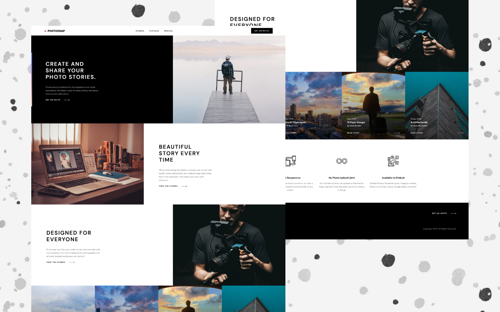
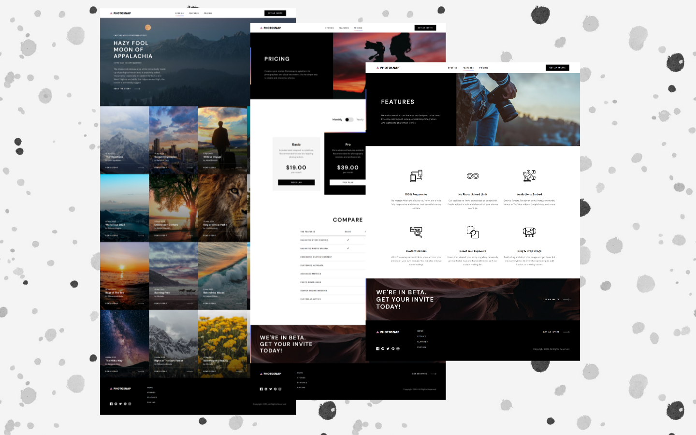
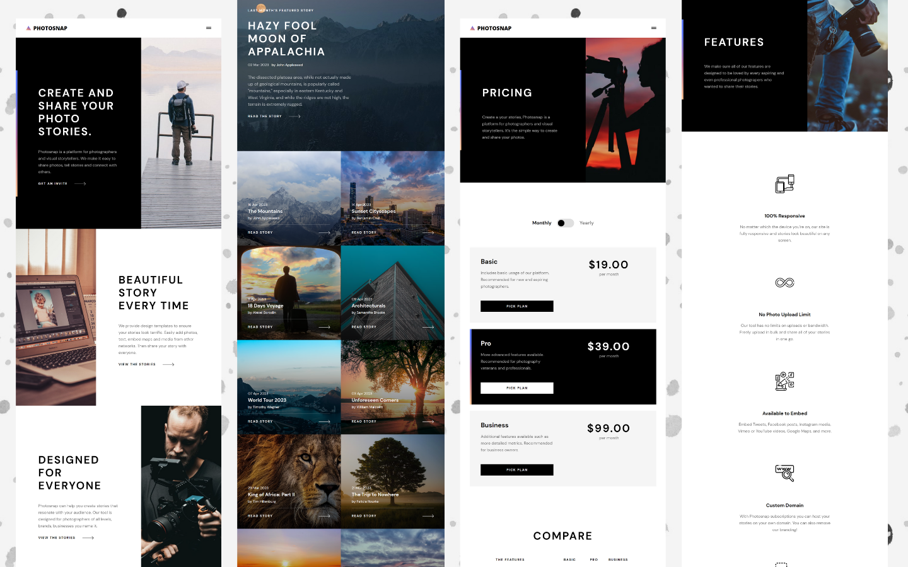
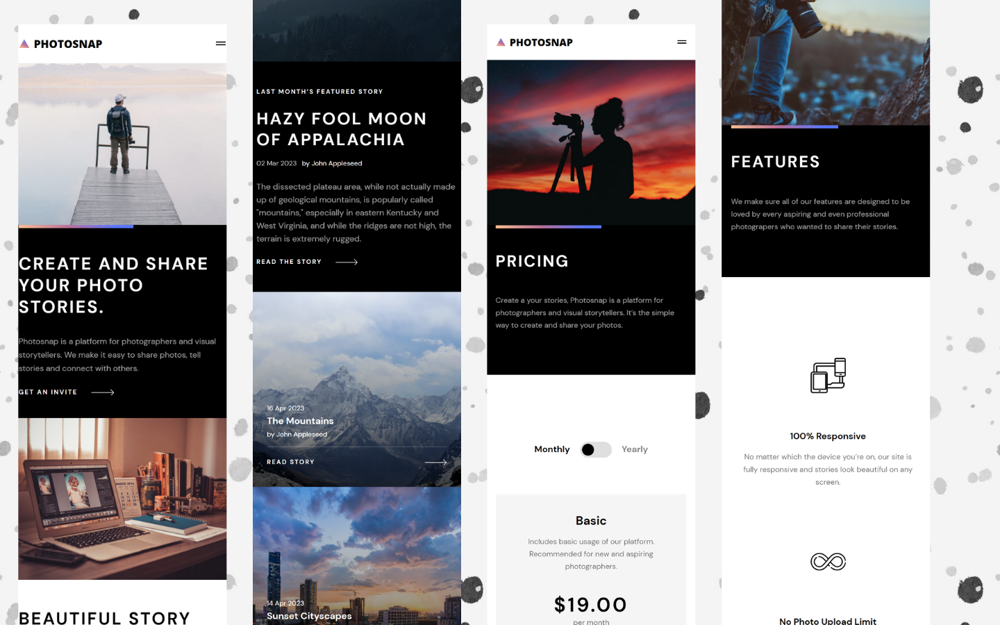

<h2>About the project</h2>

<b>Photosnap</b> is an SPA platform for photographers and visual storytellers. We make it easy to share photos, tell stories and connect with others. 

👉 Live Demo: <a href='https://photosnap-irinakruglova.vercel.app/'>Photosnap Demo</a>

<h3>Build with:</h3>

» React JS  
» React Redux  
» Firebase  
» SASS  

 

<h2>Screenshots of the Project</h2>
 
<h3 align='center'>Desktop</h3>

 
<h3 align='center'>Inner pages</h3>

 
<h3 align='center'>Tablet</h3>

 
<h3 align='center'>Mobile</h3>

